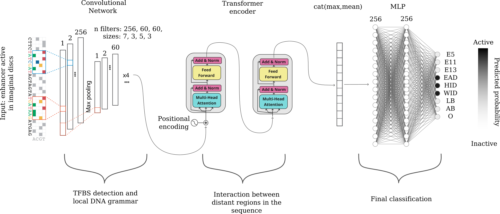

# Enhancer Predictor

A Python-based tool for predicting enhancer activity using deep learning models.  
The project uses PyTorch and NumPy, with a pre-trained model included for quick predictions.



---

## Table of Contents

- [Model Overview](#model-overview)
- [Repository Structure](#repository-structure)
- [Running Without Docker](#running-without-docker)
  - [Requirements](#requirements)
  - [Pretraining on ATAC-seq Data](#pretraining-on-atac-seq-data)
  - [Fine-tuning on Enhancer Classification](#fine-tuning-on-enhancer-classification)
  - [Running Predictions](#running-predictions)
- [Running With Docker](#running-with-docker)
  - [Build the Docker Image](#build-the-docker-image)
  - [Run Predictions in Docker](#run-predictions-in-docker)
  - [Train Models in Docker](#train-models-in-docker)
  - [Running Arbitrary Commands in Docker](#running-arbitrary-commands-in-docker)
- [Notes](#notes)


## Model Overview

The project uses a **hybrid multi-task model** combining a **convolutional neural network (CNN)** and a **transformer encoder** to predict enhancer activity across different cellular contexts from DNA sequences in *D. melanogaster*.

- The **CNN** extracts local sequence patterns via four convolutional blocks with batch normalization, ReLU activation, dropout (0.2), and max pooling.  
- **Positional encoding** is added to the CNN outputs to provide the transformer with relative positional information.  
- The **transformer encoder** captures long-range dependencies using two blocks of multi-head self-attention (8 heads) and feed-forward layers (256 neurons, ReLU, dropout 0.2) with residual connections and layer normalization.  
- The output sequence is reduced using **global average pooling** and **max pooling** to summarize both global and local signals.  
- The resulting representation passes through a **feed-forward network** (two hidden layers, 256 neurons each, ReLU, dropout 0.4) to produce the final classification across nine contexts.  

The model is trained using a **two-step strategy**: first as a regression model on ATAC-seq data for nine contexts, then fine-tuned as a classification model using annotated enhancer datasets.

---

## Repository Structure
```bash
.
├── model_structure/ # PyTorch model architectures
├── model_weights/ # Pretrained model weights
├── pretrain_model_with_ATAC.py
├── train_model_dELSs.py
├── encode_fasta.py
├── predict.py
├── run_prediction.py # Main script for running predictions
├── Dockerfile # Docker setup for reproducible environment
└── README.md
```

---

## Running Without Docker

### Requirements

Install the required Python packages:

```bash
pip install torch numpy
```
Ensure Python 3.9+ is used.
### Pretraining on ATAC-seq Data
```bash
python pretrain_model_with_ATAC.py \
  --x_train /path/to/dataset_1kb_300bp_train_augmented_encoding.npy \
  --y_train /path/to/train_target_Z_scores.npy \
  --x_val /path/to/dataset_1kb_300bp_val_encoding.npy \
  --y_val /path/to/val_target.npy \
  --batch_size 2048 \
  --n_epochs 30 \
  --patience 20 \
  --output_shape 9 \
  --device cuda \
  --checkpoint_path checkpoint_ATAC.pth \
  --z_mean /path/to/sample_means.npy \
  --z_std /path/to/sample_stds.npy \
  --max_lr 1e-4 \
  --use_amp
```
### Fine-tuning on Enhancer Classification
```bash
python train_model_dELSs.py \
  --x_train /path/to/dataset_1kb_dELSs_train_augmented_encoding.npy \
  --y_train /path/to/train_target.npy \
  --x_val /path/to/dataset_1kb_dELSs_val_encoding.npy \
  --y_val /path/to/val_target.npy \
  --batch_size 2048 \
  --n_epochs 30 \
  --patience 20 \
  --output_shape 9 \
  --device cuda \
  --checkpoint_path checkpoint.pth \
  --pretrained_weights /path/to/ATAC_transformer.pth \
  --use_amp \
  --max_lr 1e-4
```
### Running Predictions
```bash
python run_prediction.py /path/to/input.fa /path/to/output.npy --device cpu
```
Input: FASTA file of DNA sequences.

Output: NumPy array of shape (N, 9) where N is the number of sequences and 9 corresponds to predicted activity in each context.

## Running With Docker
Build the Docker Image
```bash
docker build -t enhancer_predictor .
```
### Run Predictions in Docker

Mount your local data directory and run predictions:
```bash
docker run --rm \
  -v "$(pwd)":/app/data \
  enhancer_predictor \
  run_prediction.py /app/data/input.fa /app/data/output.npy --device cpu
```
--device cpu runs on CPU; use --device cuda if GPU is available.

Container runs as non-root user (appuser).

### Train Models in Docker
Pretraining
```bash
docker run --rm -v "$(pwd)":/app/data enhancer_predictor \
  pretrain_model_with_ATAC.py \
  --x_train /app/data/dataset_1kb_300bp_train_augmented_encoding.npy \
  --y_train /app/data/train_target_Z_scores.npy \
  --x_val /app/data/dataset_1kb_300bp_val_encoding.npy \
  --y_val /app/data/val_target.npy \
  --batch_size 2048 \
  --n_epochs 30 \
  --patience 20 \
  --output_shape 9 \
  --device cuda \
  --checkpoint_path /app/data/checkpoint_ATAC.pth \
  --z_mean /app/data/sample_means.npy \
  --z_std /app/data/sample_stds.npy \
  --max_lr 1e-4 \
  --use_amp
```
Fine-tuning
```bash
docker run --rm -v "$(pwd)":/app/data enhancer_predictor \
  train_model_dELSs.py \
  --x_train /app/data/dataset_1kb_dELSs_train_augmented_encoding.npy \
  --y_train /app/data/train_target.npy \
  --x_val /app/data/dataset_1kb_dELSs_val_encoding.npy \
  --y_val /app/data/val_target.npy \
  --batch_size 2048 \
  --n_epochs 30 \
  --patience 20 \
  --output_shape 9 \
  --device cuda \
  --checkpoint_path /app/data/checkpoint.pth \
  --pretrained_weights /app/data/ATAC_transformer.pth \
  --use_amp \
  --max_lr 1e-4
```
### Running Arbitrary Commands in Docker
```bash
docker run --rm --entrypoint "" -v "$(pwd)":/app/data enhancer_predictor ls /app/data
```
This can be used for debugging or inspecting files inside the container.
## Notes

* Input/output paths inside Docker must match mounted paths (-v "$(pwd)":/app/data).

* Prediction outputs are NumPy arrays of shape (N, 9) representing enhancer activity in nine contexts.

* Use GPU if available by passing --device cuda.

* Non-root user prevents accidental permission issues on the host system.
